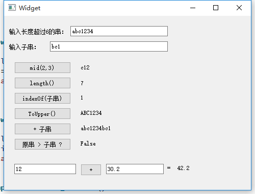
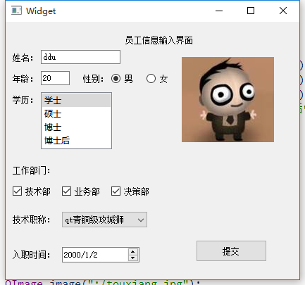

# QT
qt图形界面编程入门

## 目录说明
```
root
|-- chapter01
    |-- demo：示例
    |-- exercise：习题
|-- chapter02
    |-- demo：示例
    |-- exercise：习题
|-- chapter03
    |-- demo：示例
    |-- exercise：习题
|-- chapter04
    |-- demo：示例
    |-- exercise：习题
|-- chapter05
    |-- demo：示例
    |-- exercise：习题
|-- experiment：实验
```
### experiment
- [实验一](./experiment/experiment01.cpp)
> 程序1．编写一个C++风格的程序，用动态分配空间的方法计算Fibonacci数列的前20项并存储到动态分配的空间中。   
> 程序2．定义一个时间类Time，能提供和设置由时、分、秒组成的时间，并编写应用程序，定义时间对象，设置时间，
> 输出该对象提供的时间。  
> 程序3．用new建立一个动态一维数组，并初始化int\[10\]={1,2,3,4,5,6,7,8,9,10},用指针输出，最后销毁数组所占空间。  
> 程序4．编写一个C++风格的程序，解决百钱问题：将一元人民币兑换成1、2、5分的硬币，有多少种换法？  
> 程序5．编写一个C++风格的程序，输入两个整数，将它们按由小到大的顺序输出。要求使用变量的引用。  

- [实验二](./experiment/experiment02.cpp)
> 程序1．采用函数重载编写一个程序，分别求出两个整数、三个整数、两个单精度数、三个单精度数的最大值。  
> 程序2．声明一个时间类，时间类中有3个私有数据成员（hour,minute和second）和2个公有成员函数（SetTime()和Print_Time())。
  SetTime()根据传递的3个参数为对象设置时间；Print_Time()负责将对象表示的时间显示输出。
  在主函数中，建立一个时间类的对象，设置时间为9点20分30秒并显示该时间。
  使用构造函数代替上面的SetTime()成员函数，并在主函数中使用构造函数设置时间为10点40分50秒，显示该时间。  
> 程序3．建立类cylinder，cylinder的构造函数被传递了两个double值，分别表示圆柱体的半径和高度。用类cylinder的成员函数计算圆柱的体积，
  并存储在一个double变量中。在类cylinder中包含一个成员函数vol，用来显示每个cylinder对象的体积。在主函数中，建立一个cylinder类的对象，
  测试该类。  
> 程序4．声明一个日期类，日期的属性有年、月和日。方法有构造函数、析构函数、日期的显示。要求使用构造函数的重载，
  分别定义无参构造函数(使年月日的值分别为2013、1、1)和有参构造函数，并编写程序测试日期类。  
> 程序5．创建一个Employee类，该类中有字符数组，表示姓名、街道地址、市、省和邮政编码。把表示构造函数、ChangeName（）、Display（）函数
  原型放在类定义中，构造函数和成员函数在类外定义，构造函数初始化每个成员，Display（）函数把完整的对象打印出来。
  其中数据成员是保护的，函数是公共的。编写一个主程序定义一个Employee类对象并初始化，调用Display（）显示对象的信息。  

- [实验三](./experiment/experiment03.cpp)
> 程序1．编写一个学生和教师数据输入和显示程序，学生数据有编号、姓名、班号和成绩，
  教师数据有编号、姓名、职称和部门。要求将编号、姓名输入和显示设计成一个类person，
  并作为学生数据操作类student和教师数据操作类teacher的基类。  
> 程序2．设计一个楼房基类building，属性有floors（表示楼房层数）、areas（表示建筑面积）和name（表示建筑名称）。
  建立派生类house表示居住楼，增加成员ds表示单元数。建立派生类office表示办公楼，增加成员cs表示公司数。
  为每个类定义一个输出函数print，输出该类的相关信息。  
> 程序3．定义点类，然后由点类生成圆类，再由圆类生成圆柱体类。圆类的属性有圆心、半径；方法有构造函数、
  析构函数、显示、计算面积。圆柱体类的新增属性有高度；方法有构造函数、析构函数、显示、计算体积。
  类的应用：创建一个圆柱体对象，显示其信息，求它的体积。  
> 程序4．设计以下三个类：显卡类、主板类、集成了显卡的集成主板类。对这三个类的描述如下：
>  - 显卡类：CPU频率、显存频率。
>  - 主板类：北桥芯片类型、版型。
>  - 集成主板类：CPU频率、显存频率、北桥芯片类型、版型。  
> 
> 每个类都有自己的构造函数和析构函数，构造函数通过给定的初始值生成对应类的对象。同时这三个类都
> 能显示其数据成员的值。  
> 要求：通过类的多继承完成集成主板类的设计

- [实验四](./experiment/experiment04.cpp)
> 程序1. 定义一个点类Point，由点类分别派生出圆Circle类、长方形Rect类。
  Point 、Circle、Rect均需构造函数。在Point中定义三个虚函数用来计算面积、周长和输出，Circle、Rect类利用此虚函数实现多态性（求面积、周长和输出）。
  定义一个全局函数show用来显示对象的基本信息、面积和周长，在主函数中定义Point、Circle、Rect类的对象，
  并调用show函数显示对象的基本信息、面积和周长。  
> 程序2．写一个程序，定义抽象基类Container，由它派生出3个派生类：Sphere（球体）、Cylinder（圆柱体）、Cube（正方体）。
  用虚函数分别计算几种图形的表面积和体积。  
> 程序3．编写程序：定义抽象基类Shape，area( )为求图形面积的虚成员函数。由它派生出三个派生类：Circle（圆形）、Rectangle（长方形）、和Triangle （三角形），
  用虚函数area分别计算各种图形的面积。在主函数中，分别创建派生类的对象并计算其面积，求出它们的面积的和。
  要求用基类指针数组，使它的每一个元素指向一个派生类的对象，以体现多态性。  
> 程序4．计算正方体、球体、圆柱体的体积。要求：定义基类shape，在其中定义求体积的纯虚函数volume，并定义一个数据成员r，
  它可作为球体的半径、正方体的边长以及圆柱体的底面圆半径。由shape类派生出3个类，分别是正方体类、球体类和圆柱体类，
  在这3个类中都具有求体积的重定义版本。在主函数中统一求3种对象的体积，实现多态性。  
> 程序 5．编写一个程序，用成员函数重载运算符“+”和“-”将两个二维数组相加和相减，要求第一个二维数组的值由构造函数设置，另一个二维数组的值由键盘输入   

- 实验五
> [程序1](./experiment/experiment05_1). 尝试编写如下面所示的程序  
   
>
> [程序2](./experiment/experiment05_2). 尝试编写如下面所示的程序  
> 在输入区域输入信息后，按下Add Item按钮，数据组成一行添加到下方roster列表中  
   

### chapter01
#### demo  
- [具有共有和私有成员的账户类](./chapter01/demo/demo01.cpp)
- [get函数返回私有变量指针有问题吗？](./chapter01/demo/demo02.cpp)
- [完整的银行账户类及其使用](./chapter01/demo/demo03.cpp)
#### exercise
- [习题1](./chapter01/exercise/ex01.cpp)  
> 建立一个时钟类，具有私有属性时、分、秒，它们用3个整型变量表示。
> 同时具有显示和设置时间的公有函数display和settime(int h1, int m1, int s1)。
> 该类还具有有参数构造函数。请设计时钟类，并在main函数中验证之。

- [习题2](./chapter01/exercise/ex02.cpp)
> 定义并实现Ellipse类。采用椭圆的外接矩形左上角和右下角坐标表示椭圆（4个私有参数），
> 具有计算面积的公有函数、带参数的构造函数。函数形式自己定义。在主函数中使用构造函数初始化，
> 计算椭圆的面积并输出。在main函数中验证类的正确性。

- [习题3](./chapter01/exercise/ex03.cpp)
> 定义并实现三角形类，其成员变量包括3个边长变量，成员函数包括构造函数、
> 计算面积函数以及是否构成直角三角形、锐角三角形核钝角三角形等函数。
> - 若两短边平方和等于最长边的平方，即为直角三角形  
> - 若两短边平方和大于最长边的平方，即为锐角三角形  
> - 若两短边平方和小于最长边的平方，即为钝角三角形  
> 
> 在主函数中由用户输入3个边的值，先判断三角形是否合法，若合法则用构造函数生成一个对象。
> 输出对象的面积以及三角形的类型。
> 以下是运行样例。  
> 输入：3  4  5  
> 输出：面积6，是直角三角形  

- [习题4](./chapter01/exercise/ex04.cpp)
> 定义并实现一个有理数类Rational。该类包括如下特征信息：
> - 私有成员分子top和分母bottom
> - 有参数构造函数
> - 当前对象加另一个有理数other的函数Add(Ration other)，加法的结果保存在当前对象中
> - 当前对象减另一个有理数other的函数Sub(Ration other)，减法的结果保存在当前对象中
> - 以“分子/分母”的形式输出有理数的函数Print
>
> 在main函数中验证类的正确性

### chapter02
#### demo 
- [人员(Person)类及其子类雇员类(Employee)的定义及使用](./chapter02/demo/demo01.cpp)  
- [人员(Person)类的私有派生子类雇员类(Employee)的使用](./chapter02/demo/demo02.cpp)
- [派生类构造函数和析构函数的执行](./chapter02/demo/demo03.cpp)
- [派生类对象转换为基类对象使用](./chapter02/demo/demo04.cpp)
- [虚函数实现多态性](./chapter02/demo/demo05.cpp)
- [抽象Shape类的实现及使用](./chapter02/demo/demo06.cpp)
- [定义一个复数类，并重载加法运算符以适应对复数运算的要求](./chapter02/demo/demo07.cpp)
#### exercise
- [习题1](./chapter02/exercise/ex01.cpp)
> 定义点类与彩色点类  
> 定义一个空间中的点类Point作为基类，包括3个坐标值私有成员变量（整型变量x、y、z）和公有构造函数，
> 并增加显示变量值的公有成员函数Show。  
> 定义一个空间中的彩色点类ColorPt作为派生类，并且包括一个颜色值私有成员变量（用字符数组表示）和公有构造函数，
> 再增加显示变量值的公有成员函数Show。  
> 最后在主函数中定义点类和彩色点类的各一个对象，点类对象用（2,3,5）初始化，
> 彩色点用（10,20,30,"red"）初始化，调用Show函数显示信息。  
> 运行样例如下。
>  
> 输入：（无输入）  
> 输出：  
> 2 3 5    
> 10 20 30 red  

- [习题2](./chapter02/exercise/ex02.cpp)
> 创建基类Cellphone（普通手机类）及其子类Smartphone（智能手机类）。
> 基类包含品牌、本机号码两个私有属性，包括设置和获取属性值的函数（即setxxx和getxxx函数），
> 还包括接听电话、拨打电话的方法，其函数原型为  
> ````
> void PickUp(int telNum);  //接听来自telNum的电话
> void Callsomebody(int telNum);  //呼叫号码为telNum电话
> ````
> 上面两个函数仅显示一条动作信息，例如“接到1234567”打来的电话。
> 子类中还含有存储容量大小、屏幕大小属性，具有相应的设置和获取属性的函数，
> 还有一个播放音乐的函数，原型如下：
> ````
> void PlayMusic(char *mName);  //播放音乐mName 
> ````
> 这个函数也是仅显示一条动作信息。

- [习题3](./chapter02/exercise/ex03.cpp)
> 修改[例2-6](./chapter02/demo/demo06.cpp)的内容，在基类定义计算周长的纯虚函数，
> 在子类中实现计算周长的函数，并在主函数中使用这一功能。 

- [习题4](./chapter02/exercise/ex04.cpp)
> 虚函数综合练习。  
> 定义基类——图形类Geometry及其派生类——矩形类、等腰直角三角形类。
> 矩形类有两个参数H和V，代表高和宽。等腰直角三角形类有参数E，代表直角边的长度。
> 基类中包括一个绘制图形的公有成员虚函数Draw，并且在派生类中分别实现函数Draw，
> 在该函数中用符号*显示图形。最后在主函数中定义子类的各一个对象并调用构造函数初始化，
> 再利用Draw函数分别显示它们的字符形状图。

- [习题5](./chapter02/exercise/ex05.cpp)
> 运算符号重载  
> 建立一个三维向量类，包含x、y、z3个整数属性，利用符号重载实现加号和减号的函数  
> 运行样例如下。  
> 输入s1内容：  
> 第0个：10  
> 第1个：20  
> 第2个：30  
> 输入s2内容：  
> 第0个：9   
> 第1个：8   
> 第2个：7   
>
> \[s1-s2\]内容为：1 12 23  
> \[s1+s2\]内容为：19 28 37  

### chapter03
#### demo 
- [利用手工编码方式建立“Hello Qt!”程序](./chapter03/demo/demo01)
- [利用无UI的应用程序向导建立“Hello Qt!”程序](./chapter03/demo/demo02)
- [利用Qt设计器建立“Hello Qt!”程序](./chapter03/demo/demo03)
- [无图像用户界面的简单信号和槽的例子](./chapter03/demo/demo04)
- [使用控件内部定义好的信号和槽](./chapter03/demo/demo05)
#### exercise
- 习题1
> 请对比用无UI向导方式和用有UI的向导自动建立基于QDialog的程序时，编译运行后工程目录中各有哪些不同的文件，哪些文件是自动生成的，
> 这些自动生成的文件是如何被main函数使用的。  
> 答：（个人观察，不一定是正确的）  
> 无UI向导自动生成的文件会有`demo02.pro`,`dialog.h`,`dialog.cpp`,`main.cpp`，而main如何使用的，首先在`main.cpp`中通过引入头文件`#include "dialog.h"`
> 将dialog相关的引入进入，然后在main函数的这行代码`Dialog w`，调用`dialog.h`头文件中`Dialog`类的初始化，
> 而`Dialog`的构造函数在`dialog.cpp`中定义。  
> 有UI向导自动生成的文件会有`demo03.pro`,`dialog.h`,`dialog.cpp`,`main.cpp`,`dialog.ui`，main中使用首先也是`Dialog w`，
> 这句代码，这句会引用`dialog.h`中的构造函数，而构造函数在`dialog.cpp`进行类外定义，而在构造函数中通过使用`ui(new Ui::Dialog)`给内嵌对象ui初始化，
> 而这句代码调用`ui_dialog.h`中的构造函数。

- [习题2](./chapter03/exercise/ex02)
> 例3-5中的标签QLabel对象可以通过setText函数设置显示内容，并且setText函数本身是一个槽函数，可以接收信号。
> 仿照例3-5编写程序，标签对象初始化显示0，每次单击标签对象后，其显示内容就加1，依次变为1、2、3等。  

### chapter04
#### demo
- [窗体几何尺寸的设置和获取](./chapter04/demo/demo01)
- [窗口标题及大小控制](./chapter04/demo/demo02)
- [用标签显示位图](./chapter04/demo/demo03)
- [按钮的使用](./chapter04/demo/demo04)
- [单选按钮、复选框的使用](./chapter04/demo/demo05)
- [组合框的使用](./chapter04/demo/demo06)
- [列表框的使用](./chapter04/demo/demo07)
- [单行编辑框的使用](./chapter04/demo/demo08)
- [滑动条的使用](./chapter04/demo/demo09)
- [进度条示例](./chapter04/demo/demo10)
- [抽屉效果示例](./chapter04/demo/demo11)
- [多页面切换效果](./chapter04/demo/demo12)
- [层叠窗体控件的使用](./chapter04/demo/demo13)
- [树状显示效果](./chapter04/demo/demo14)
- [表格控件显示效果](./chapter04/demo/demo15)
- [QTextEdit简单使用](./chapter04/demo/demo16)
#### exercise
- 习题1
> 编程实现一个布局合理美观的员工信息输入界面，要求输入姓名、年龄、性别、学历、入职时间、工作部门、
> 技术职称以及员工照片。要求综合使用文本框、单选按钮、复选框、标签、列表框和组合框。界面控件定位全部采用人工设定的方式。  
> 


### chapter05
#### demo
- [添加文件打开菜单及工具栏按钮](./chapter05/demo/demo01)
- [利用Qt Designer添加文件打开菜单及工具栏按钮](./chapter05/demo/demo02)
- [一个简单的模态对话框](./chapter05/demo/demo03)
- [从模态对话框得到数据](./chapter05/demo/demo04)
- [从非模态对话框得到数据](./chapter05/demo/demo05)
#### exercise